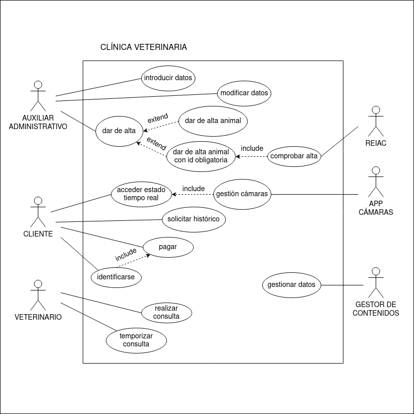

# TAREA 1 DIAGRAMAS CASO DE USO: CLÍNICA VETERINARIA

## Posibles actores

-Auxiliar administrativo

-REIAC

-Veterinario

-Cliente

-App cámaras

-Gestor de contenidos

## Posibles casos de uso

-Introducir datos

-Gestionar datos

-Comprobar alta REIAC

-Realizar consulta

-Temporizar consulta

-Acceder a estado del animal

-Gestionar cámaras

-Identificarse para pagar

-Pagar

-Obtener histórico del animal

-Dar de alta animal

## Diagrama de casos de uso

{padding="2vw"}
