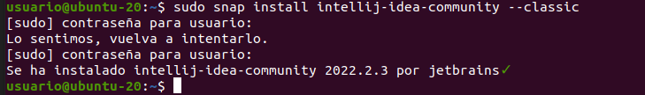

# Instalación del IDE IntelliJ IDEA

## Prerrequisitos

Comprobamos que Java esté instalado:

## Instalación

Instalamos mediante un snap: 

## Lanzamiento de IntelliJ

Lanzo IntelliJ y compruebo que se ha instalado bien:

