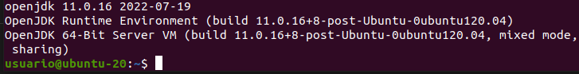
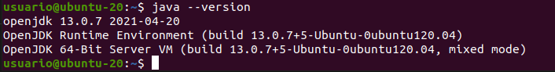
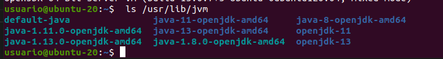
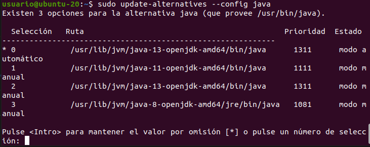
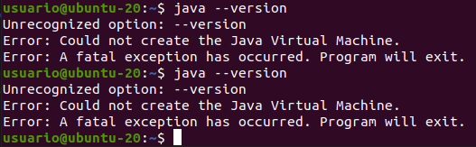
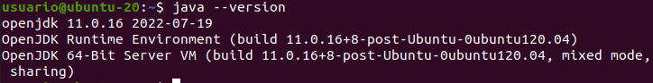
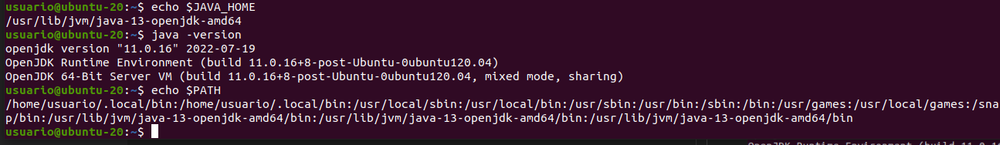

# Instalación de JDK en Ubuntu

## Instalar Java en el sistema:

    sudo apt-get update
    sudo apt-get install default-jdk

Comprobamos que tenemos java instalado:

    java --version

Para mi distribución de Linux (Ubuntu-20.04) se ha instalado la versión 11 por defecto. 

## Instalación de versiones específicas:

    sudo apt install openjdk-13-jdk
    sudo apt install openjdk-8-jdk

Compruebo de nuevo la versión de java instalada:

    java --version

Parece que la versión que el sistema considera instalada es la 13.
Como queremos trabajar con la 8, voy a tener que editar las variables de entorno correpondientes.

## Configuración de las variables de entorno

Compruebo las versiones de OpenJDK instaladas:

     ls /usr/lib/jvm

Para configurar las variables de entorno hay dos posibilidades:

### 1ª opción: modificar el fichero 'profile'

    sudo update-alternatives --config java

Selecciono la versión 8, para ello pulsamos 3 como se indica.
Compruebo que se han realizado los cambios:

No pinta bien, pruebo a seleccionar otra versión, la 11.

Esta vez si que consigue crear la JVM. Parece que no puedo trabajar sobre java 8 en mi distribución. 

### 2ª opción: modificar directamente las variables de entorno

    JAVA_HOME=/usr/lib/jvm/(SELECCIONA UN PATH DE LA VERSION QUE DESEAS QUE SE EJECUTE)
    PATH=$PATH:$HOME/bin:$JAVA_HOME/bin
    export JAVA_HOME
    export JRE_HOME
    export PATH

Pruebo a cambiar a la versión 13:

No consigo cambiar la versión de Java mediante el procedimiento sugerido.