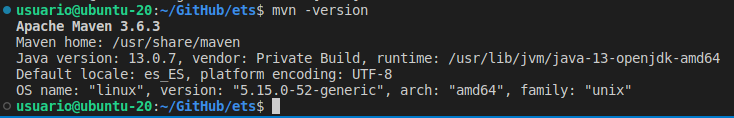

# Instalación de MAVEN en Ubuntu

## Instalar Apache Maven

Instalo y verifico:

    sudo apt update
    sudo apt install maven
    mvn -version

## Instalar versión concreta de Apache Maven

Descargo la última versión de Apache Maven:

    wget https://www.apache.org/dist/maven/maven-3/3.8.6/binaries/apache-maven-3.8.6-bin.tar.gz -P /tmp

Extraigo el archivo en el directorio 'opt':

    sudo tar xf /tmp/apache-maven-*.tar.gz -C /opt

Creo un enlace simbólico a la carpeta de instalación de Maven:

    sudo ln -s /opt/apache-maven-3.8.6 /opt/maven

Cuando se lance una nueva versión, tendré que apuntar a ella modificando la ruta del enlace simbólico.