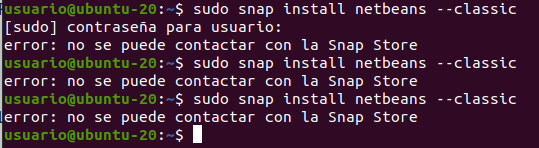
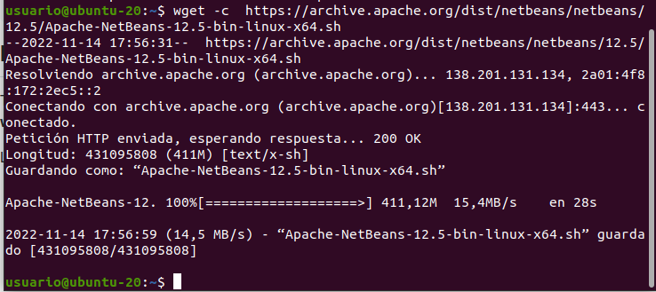
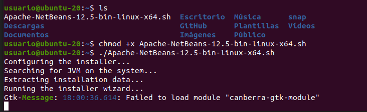
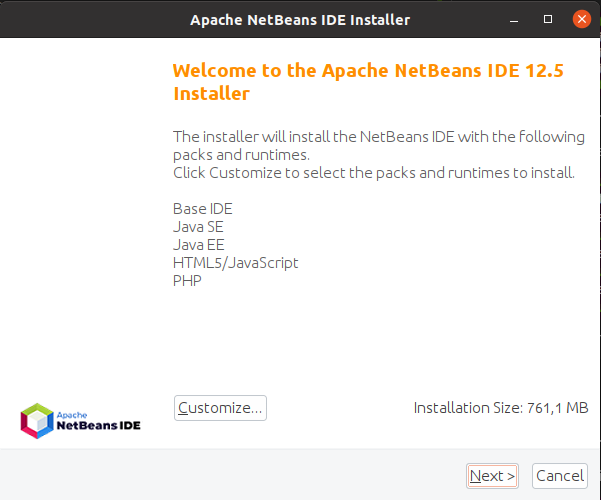
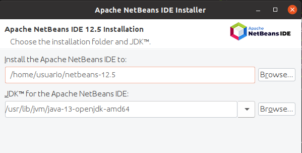

# Instalación de Netbeans 12 en Ubuntu

## Comrobación de la instalación de Java

## Instalación

No conseguí realizar la instalación mediante snap:

Si quisiera desinstalar Nebeans:

    sudo snap remove netbeans

## Instalación a través de wget

Descargo el script de instalación:

Hago que el script sea ejecutable y lo ejecuto:

Se abre un asistente de instalación:

Sigo los pasos de la configuración para terminar con el procedimiento.

