

# Manipulación Avanzada en Git

## Ejercicio1

Con el comando 'git log' veo el registro histórico del repositorio, con la información de los diferentes commits realizados.

---

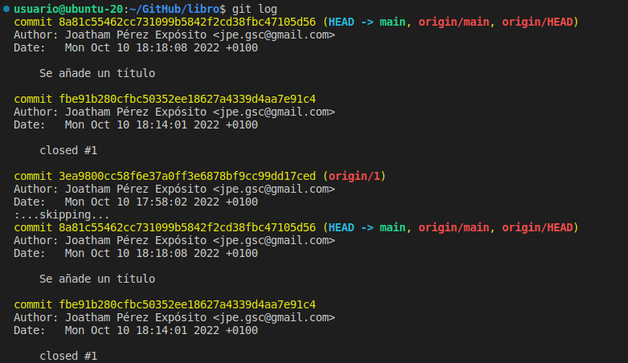

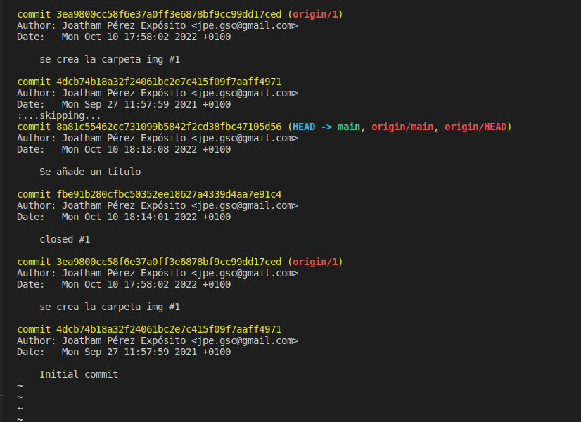

---

Creo el directorio y el fichero usando el comando 'cat', hago seguimiento de los cambios con 'git add' y realizo el commit correspondiente.

---

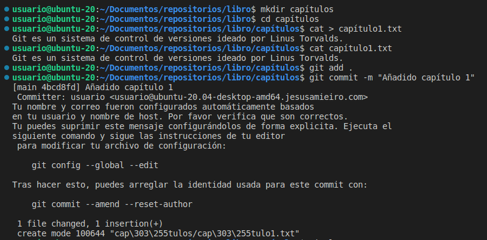

---

Compruebo que el histórico esté actualizado.

---

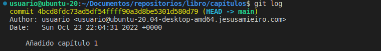

---
## Ejercicio2

Creo un nuevo fichero y comparo la versión actual con la segunda anterior. Para ello utilizo las opciones del comando 'git diff'.

---

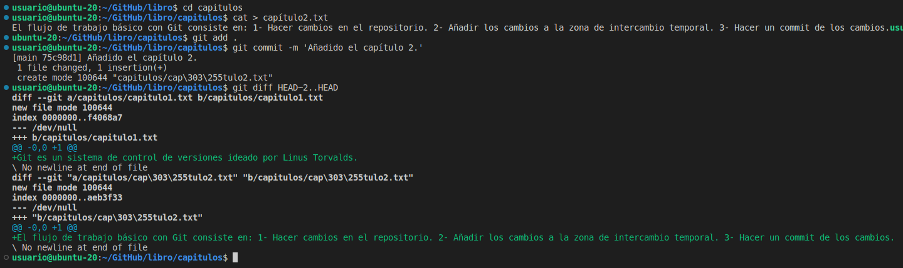

---
## Ejercicio3

Creo un fichero y comparo la versión actual con la primera de todas. Para ello necesito el hash asociado al commit, lo obtengo mediante 'git log'.

---

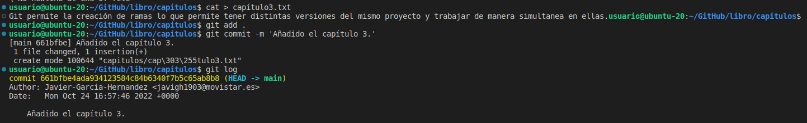

---

Una vez tengo el hash correspondiente puedo incluirlo en el comando 'git diff'.

---

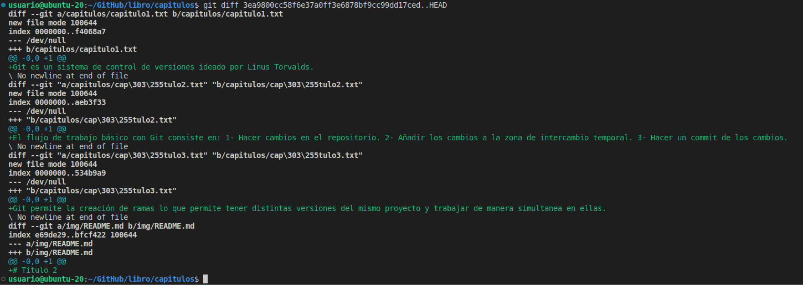

---
## Ejercicio4

Genero un fichero que sirva como índice del libro. Para comprobar quién realizo el commit correspondiente utilizo el comando 'git annotate'.

---

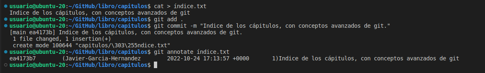

---
## Ejercicio5

Creo una nueva rama con 'git branch' y compruebo la estructura del repositorio.

---

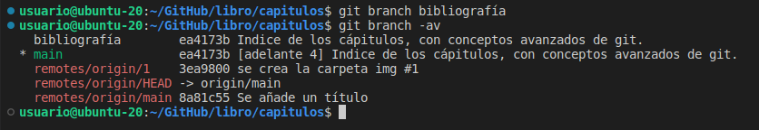

---
## Ejercicio6

Creo un nuevo fichero y esta vez, al solicitar el historial se pide la información de las distintas ramas. 

---

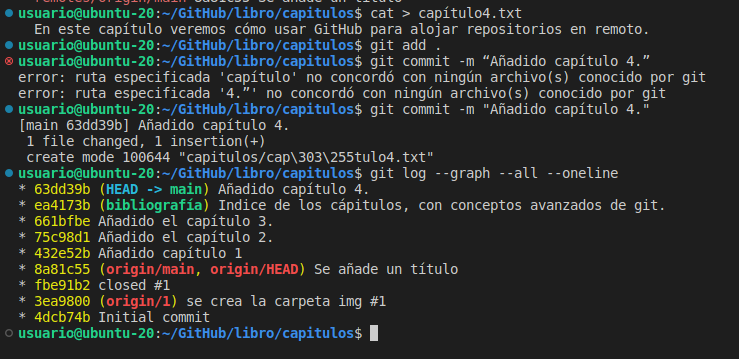

---
## Ejercicio7

Cambio a la rama 'bibliografia' con el comando 'git checkout' y creo un fichero. De nuevo solicito el histórico de las ramas del repositorio y puedo ver como en el momento de crear el fichero me encontraba en dicha rama. 

---

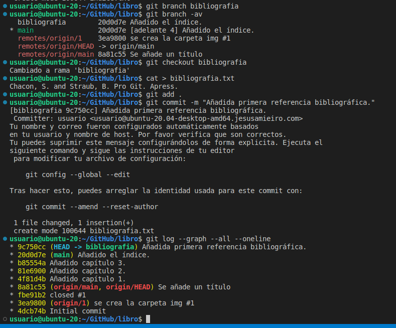

---
## Ejercicio8

Fusiono las ramas 'main' y 'bibliografia', eliminando esta última. Compruebo que toda la información se encuentra ahora en la rama 'main'.

---

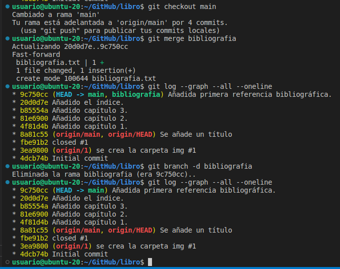

---
## Ejercicio9

Creo una nueva rama 'bibliografia' y genero un fichero 'bibliografia.txt' con contenido diferente al de la rama 'main'.

---

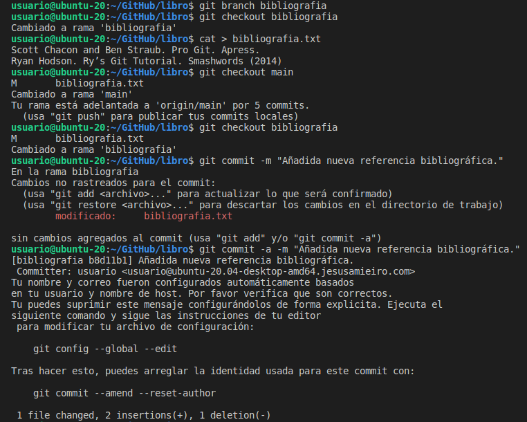

---
De nuevo en la rama 'main' realizo un 'merge' y surge un aviso de la incongruencia en el fichero, como era de esperar. Para solucionarlo abro el fichero para su edición mediante el comando 'nano'. 

---

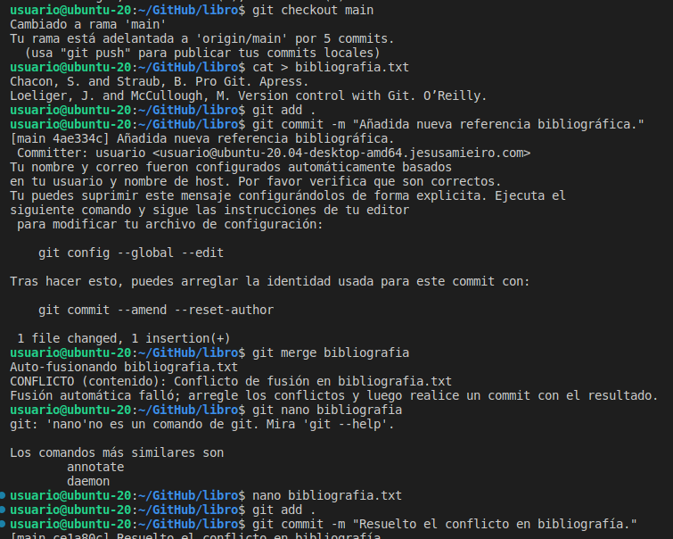

---
Por último, compruebo que queda recogido en el historial todo el proceso de 'merge' con el 'commit' que indica la resolución del conflicto incluido.

---
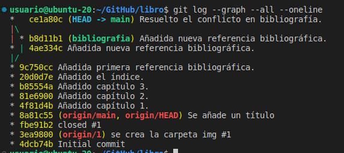

