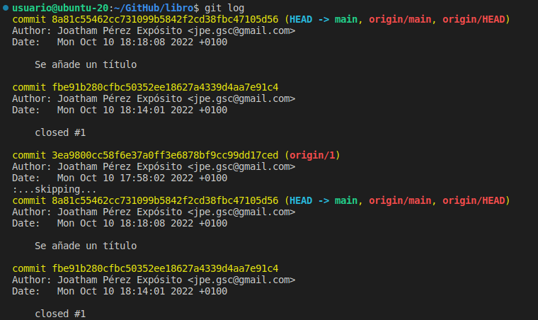

# Manipulación Avanzada en Git

## Ejercicio1

Con el comando 'git log' veo el registro histórico del repositorio, con la información de los diferentes commits realizados.

Creo el directorio y el fichero usando el comando 'cat', hago seguimiento de los cambios con 'git add' y realizo el commit correspondiente.

Compruebo que el histórico esté actualizado.

## Ejercicio2

Creo un nuevo fichero y comparo la versión actual con la segunda anterior. Para ello utilizo las opciones del comando 'git fiff'.

## Ejercicio3

Creo un fichero y comparo la versión actual con la primera de todas. Para ello necesito el hash asociado al commit, lo obtengo mediante 'git log'.

Una vez tengo el hash correspondiente puedo incluirlo en el comando 'git diff'.

## Ejercicio4

Genero un fichero que sirva como índice del libro. Para comprobar quién realizo el commit correspondiente utilizo el comando 'git annotate'.

## Ejercicio5

Creo una nueva rama con 'git branch' y compruebo la estructura del repositorio.

## Ejercicio6

Creo un nuevo fichero y esta vez, al 

