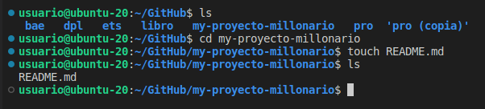

## Trabajo diario a través de git

Creo un repositorio en GitHub:

Lo clono en local: 

Creo un documento README.md en mi repositorio local:

En el documento añado todos los comandos ejecutados hasta el momento.

